

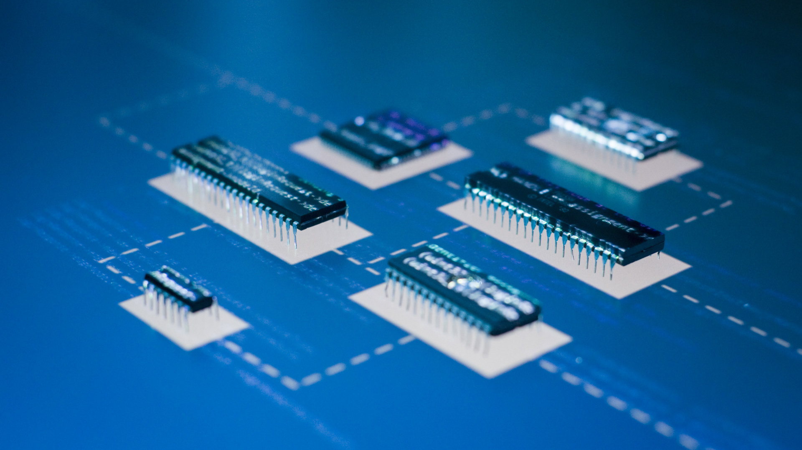

# Basic Electronics

---

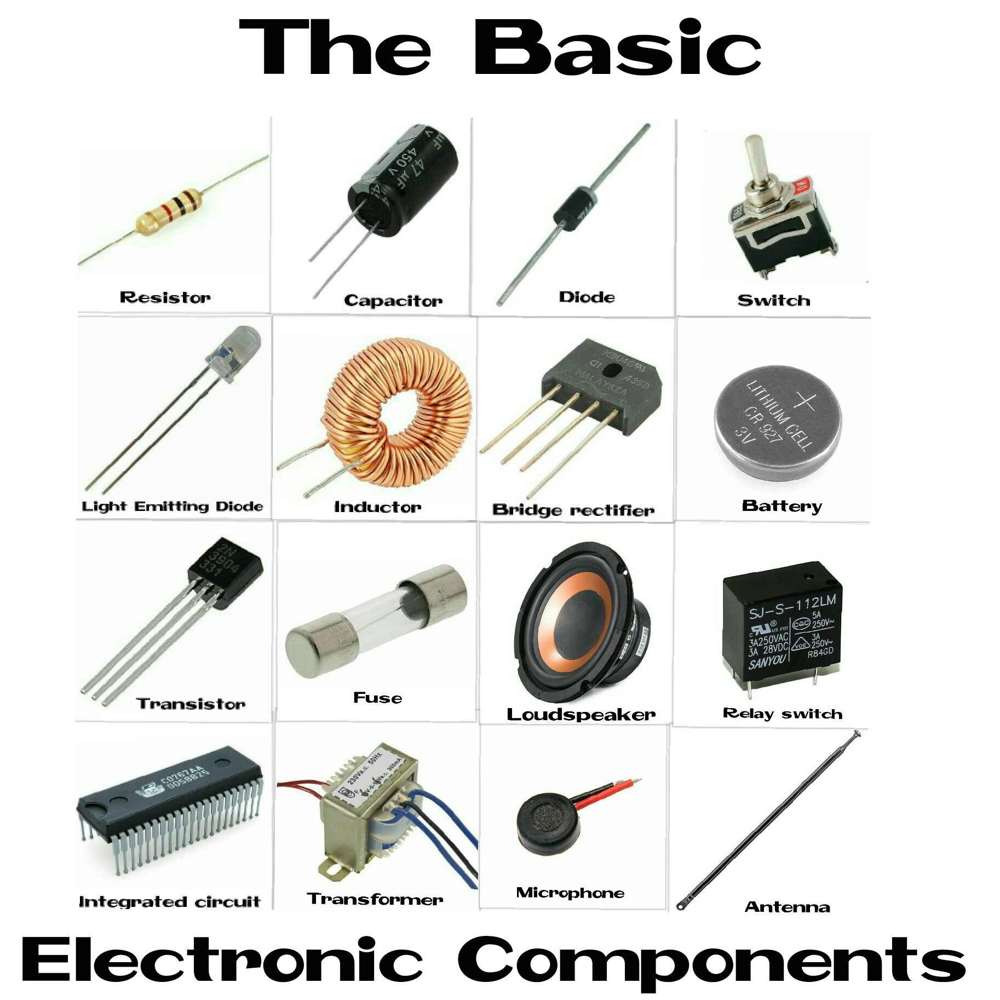

---
# Resistor

- passive electrical component 
- implements electrical resistance
- used to reduce current flow

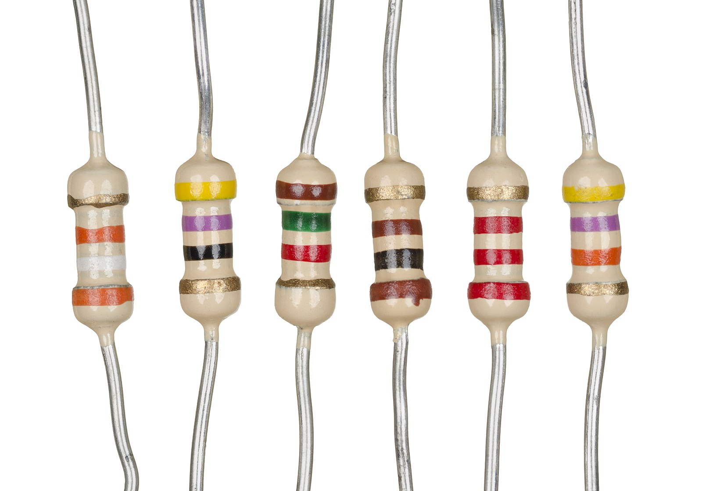

---

---

# Capacitor

- stores electrical energy in an electric field

---

---

# Diode

- two-terminal electronic component 
- conducts current in one direction  
- it has low (ideally zero) resistance in one direction, and high (ideally infinite) resistance in the other.

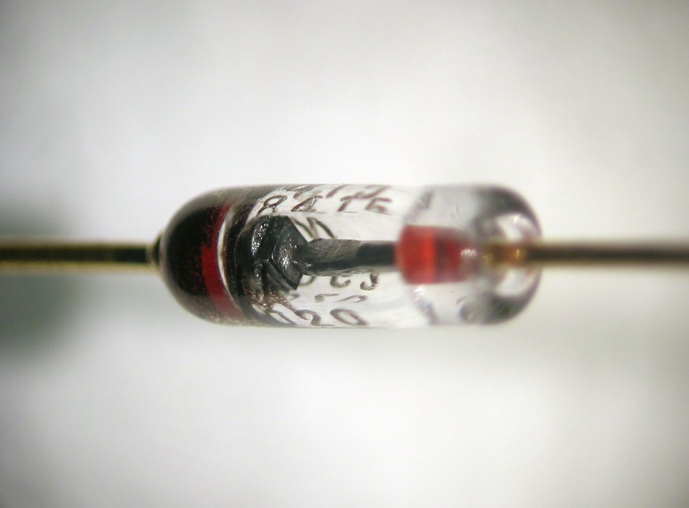

---

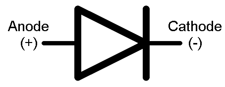

---

# LED

- LED stands for light emitting diode
- lights up when electricity passes through it

---

# Switche

- mechanical device that creates a break in a circuit. 
- When you activate the switch, it opens or closes the circuit.
- NC / NO

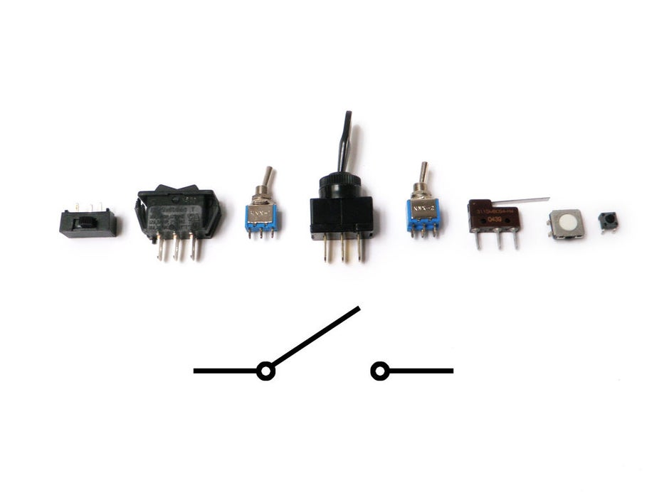

---

# Transistors

A transistor takes in a small electrical current at its base pin and amplifies it such that a much larger current can pass between its collector and emitter pins. The amount of current that passes between these two pins is proportional to the voltage being applied at the base pin.

---

# NPN vs PNP

There are two basic types of transistors, which are NPN and PNP. These transistors have opposite polarity between collector and emitter. 

---

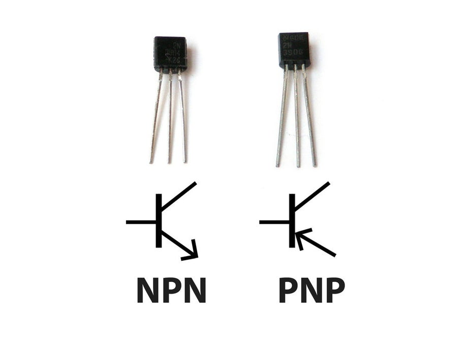

---

# Potentiometer

Potentiometers are variable resistors. In plain English, they have some sort of knob or slider that you turn or push to change resistance in a circuit. If you have ever used a volume knob on a stereo or a sliding light dimmer, then you have used a potentiometer.

---

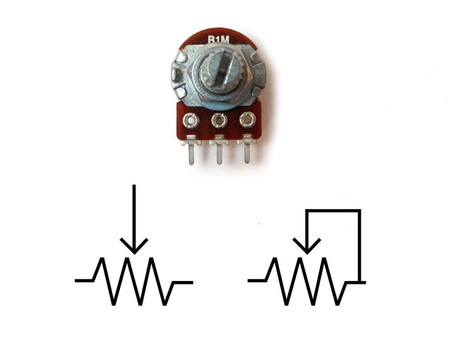

---

# Battery

- container which converts chemical energy into electricity.
- stores power

---

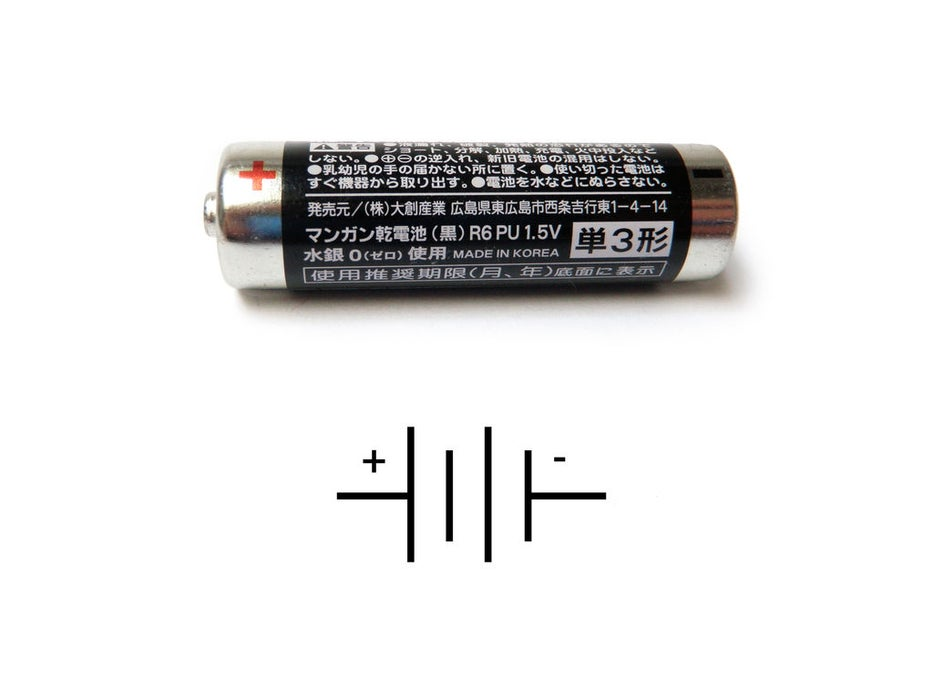

---

# Fuse

- protects circuit

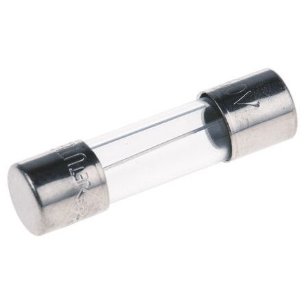

---

# AC / DC

There are two types of electrical  signals , those being alternating current (AC), and direct current (DC).

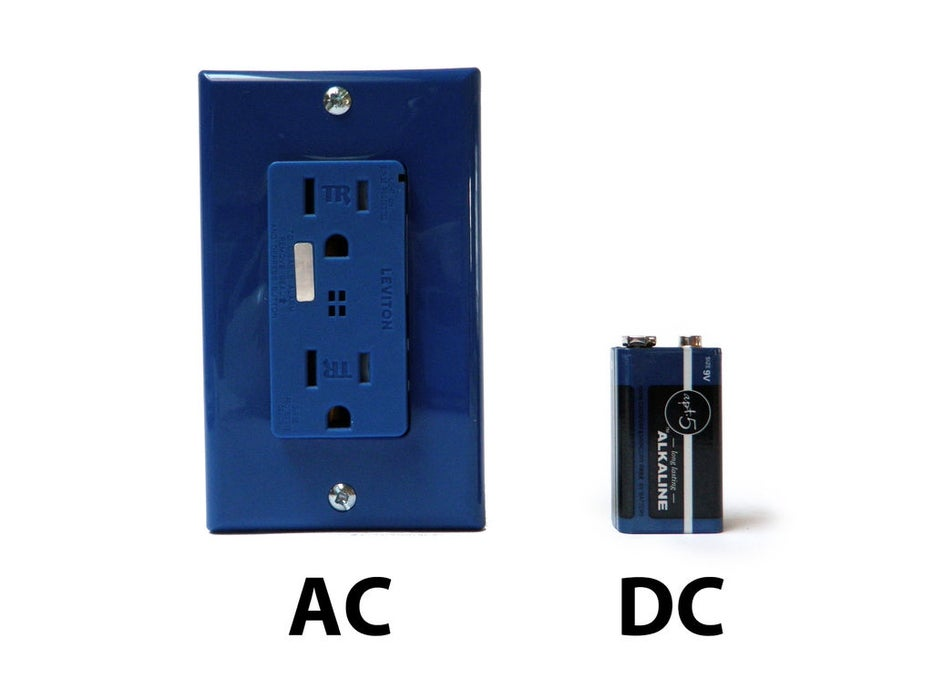

---

# AC

With alternating current, the direction electricity flows throughout the circuit is constantly reversing. You may even say that it is alternating direction. The rate of reversal is measured in Hertz, which is the number of reversals per second. So, when they say that the US power supply is 60 Hz, what they mean is that it is reversing 120 times per second (twice per cycle).

---

# DC

With Direct Current, electricity flows in one direction between power and ground. In this arrangement there is always a positive source of voltage and ground (0V) source of voltage. You can test this by reading a battery with a multimeter. For great instructions on how to do this, check out Ladyada's multimeter page (you will want to measure voltage in particular).

---

# Basic Circuit

---

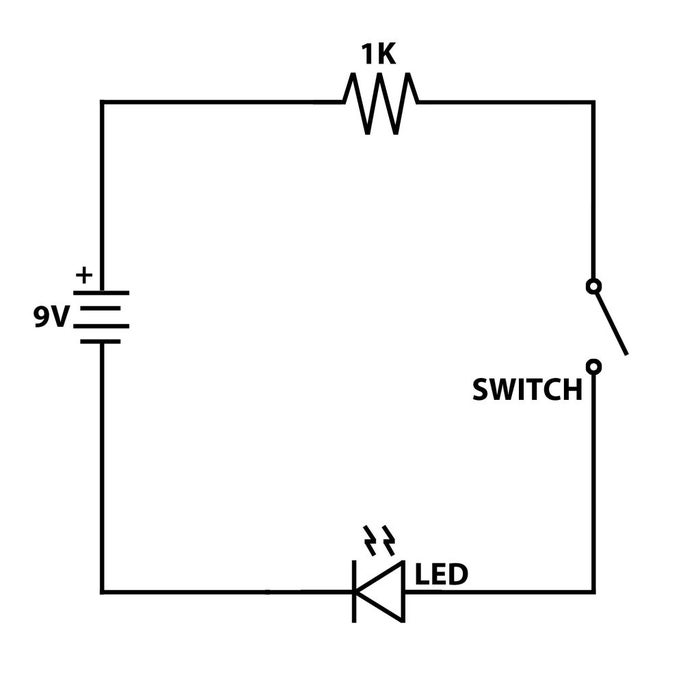

---

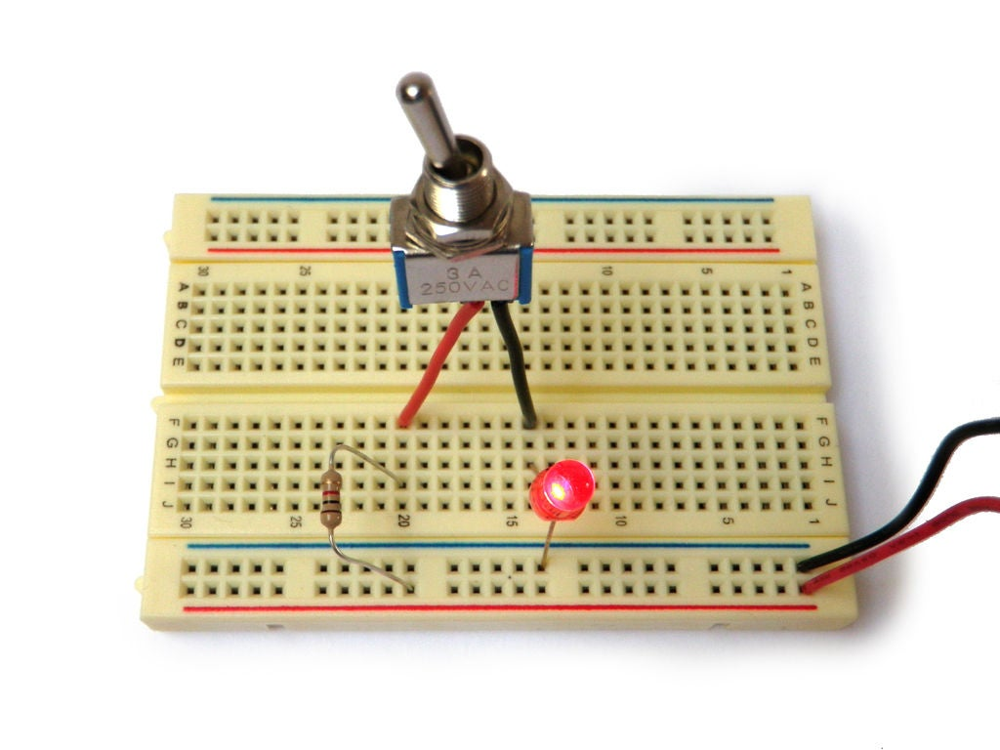

---

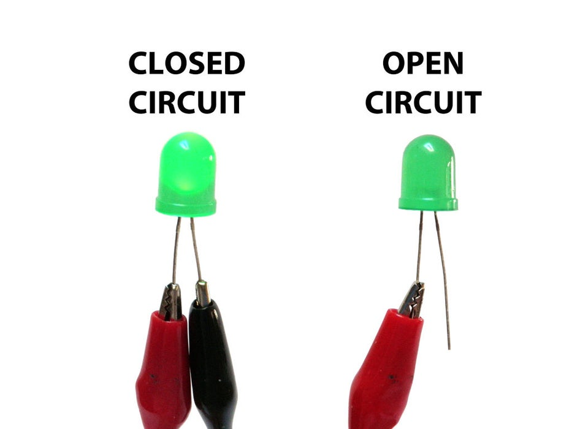

---

# THX :)

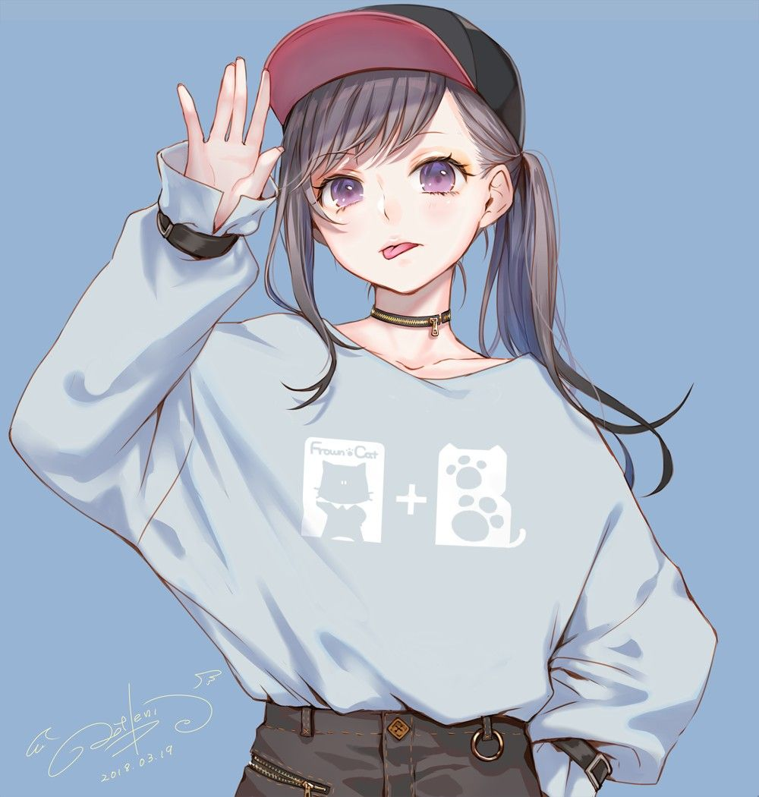